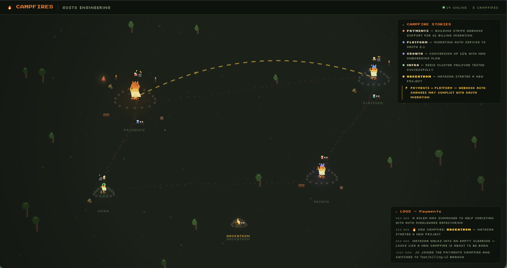

# 🔥 Campfires

> **Note:** Vibe should be:
>
> - Less: "visibility tool for oversight", More: "coordination infrastructure for velocity"
> - Less: "nobody knows what engineers are doing", More: "at AI-speed, stale information kills velocity"
> - Less: "everyone works in silos", More: "we lack tools for efficient, effective, and fun context sharing"
> - Less: "makes work visible", More: "reduces coordination lag from hours to seconds"
> - Less: "AI-summarized for PMs/execs", More: : "enables hive operation where everyone sculpts the living prototype together"

Campfires is real-time coordination infrastructure for teams building at AI speed. Our Claude Code plugin ambiently captures what you're working on (files, branches, commits) and aggregates activity across your team (humans and agents). The Campfires web app transforms that data into a live map of what everyone is building (visualized as flames in a campfire), with real-time activity logs and AI-generated project summaries that open the door for collaboration and keep cross-functional stakeholders in the loop without interrupting builders.

```
Source                   System                    Surface
┌──────────────────┐   ┌──────────────────┐   ┌──────────────────┐
│ Claude Code      │   │ Campfires        │   │ Campfire Stories │
│ Plugin           │──▶│ Server           │──▶│ Web App          │
│                  │   │                  │   │                  │
│ - File edits     │   │ - Activity       │   │ - Pixel-art map  │
│ - Commands       │   │   storage        │   │ - Zoom/pan       │
│ - Sessions       │   │ - Team           │   │ - Day/night      │
│                  │   │   organization   │   │   cycle          │
│                  │   │ - AI             │   │ - AI summaries   │
│                  │   │   summarization  │   │                  │
└──────────────────┘   └──────────────────┘   └──────────────────┘
```

---

## Problem

In Steve Yegge's recent article on companies building at AI-speed, he wrote:

> "An external fourth contributor overseas wasted a bunch of time acting on 2-hour-old information, because everything is moving so fast... You need full transparency at all times, at their speeds, or nobody will ever see what you are doing and you'll fall irretrievably behind."
>
> — ["The Anthropic Hive Mind"](https://steve-yegge.medium.com/the-anthropic-hive-mind-d01f768f3d7b)

Expanding on this, we see four problems that get worse as teams are enabled by AI to execute ideas faster:

- **Coordination lags behind development velocity.** Coding may be 10x faster, but teams building together still coordinate through Slack and standups to stay aligned. The bottleneck has shifted from writing code to sharing context.
- **Agents operate invisibly.** AI assistants are doing real work, but they're often unsupervised, hidden from each other, and cross-functionally invisible.
- **Context goes stale instantly.** The information exists — in git logs, terminals, uncommitted branches — but there's no ambient layer connecting it in real time. Work happening in parallel can easily be done with critically outdated context.
- **Teams collide unknowingly.** At 10x velocity, the expense and inefficiency of two teams building the same thing (or contradicting things) is significant.

---

## Campfires' Approach

Campfires reduces coordination lag from hours to seconds by making work visible the moment it happens, and summarizing progress for the people who need it.

- **For developers** that means real-time visibility into who's working on what, and AI-assisted updates for your stakeholders on what you're building.
- **For engineering stakeholders** that means seeing frequent development status updates in plain language — no code, no jargon, no bothering a busy engineer for routine updates.
- **For leadership** that means an org-wide view of what's being worked on, making it easier to see where there's energy, overlap, or misalignment.

The key concepts of our platform include:

- **Real-time awareness:** See teammates' active files, commits, and branches as they happen
- **AI agents as participants:** Claude Code agents are automatically detected and tracked alongside their human, with distinct representation on the map
- **AI-summarization:** Business-legible team updates generated every 15 minutes from real activity data
- **Cross-team visibility:** Visit any campfire in your organization as an observer
- **Zero configuration for developers:** Claude Code plugin captures activity automatically; no additional setup
- **Privacy by default:** One-click toggle to go dark when you need focus time

---

## Our Web App



The Campfires web app ("Campfire Stories") is a full-screen pixel-art map view with two components:

1. **Organization Map**: An RPG-style pixel-art canvas of your entire organization. Each campfire represents a team. Fire intensity reflects how active the team is. Developers appear as animated sprites; AI agents appear as golems linked to their human. Click any campfire to see who's gathered and what they're building. Supports mouse-wheel zoom, click-drag panning, and a day/night cycle with twinkling stars and dynamic campfire glow.
2. **Campfire Stories panel (org-wide summaries)**: An overlay panel showing AI-generated one-liner summaries for each team, updated in real time via SSE. Clicking a campfire opens the **Logs panel** with team-level narrative detail.

### Naming Conventions

Campfires uses fire-themed naming throughout the app:
| Level | Name | Emoji | Description |
|:------------ |:------------ |:-----:|:------------------------------- |
| Organization | **Bonfire** | 🔥 | Your entire org — "Acme Bonfire" |
| Team | **Campfire** | 🏕️ | A single team — "Payments Campfire" |
| Individual | **Human** | | One developer's activity stream |
| Agent | **Golem** | | One AI agent's activity stream |
| Organization | **Spark** | ⚡ | When a concept synergizes, blocks, or repeats another team's concept |

---

## Getting Started

### Prerequisites

- **Node.js** v18+ (ES2022 target)
- **npm** v9+ (workspaces used for monorepo)
- **Claude Code** (optional, for the plugin)

### 1. Clone and install

```bash
git clone https://github.com/christian-hillson/campfires.git
cd campfires
npm install
```

### 2. Configure the server environment

Copy the example env file:

```bash
cp server/.env.example server/.env
```

The defaults work out of the box for local development:

| Variable            | Default                                       | Notes                                                         |
| ------------------- | --------------------------------------------- | ------------------------------------------------------------- |
| `PORT`              | `3000`                                        | Server port                                                   |
| `DB_PATH`           | `./campfires.db`                              | SQLite database (auto-created on first run)                   |
| `JWT_SECRET`        | `change-me-in-production`                     | Auth token signing key                                        |
| `ALLOWED_ORIGINS`   | `http://localhost:5173,http://localhost:3000` | CORS whitelist (comma-separated)                              |
| `ANTHROPIC_API_KEY` | _(empty)_                                     | Optional — enables AI summaries. Falls back to stubs if unset |
| `ANTHROPIC_MODEL`   | `claude-haiku-4-5-20250514`                   | Model used for summarization                                  |

### 3. Build

Shared types must be built first — other packages depend on them:

```bash
npm run build:shared
```

Or build everything in the correct order:

```bash
npm run build:all
```

### 4. Launch

You need two terminals:

**Terminal 1 — Server** (port 3000):

```bash
npm run dev:server
```

You should see:

```
🔥 Campfires Server running on http://localhost:3000
```

**Terminal 2 — Web app** (port 5173):

```bash
npm run dev:stories
```

Open **http://localhost:5173** in your browser. The Vite dev server proxies `/api` requests to the server automatically.

> **Production:** `npm run build:all` builds the web app into `campfire-stories/dist/`, and the server serves it as a SPA at port 3000 — no separate Vite process needed. Run with `npm start`.

---

## Plugin Setup (Optional)

The Claude Code plugin captures developer activity and sends it to a running Campfires server.

### Install the plugin

From the campfires repo root:

```bash
claude mcp add-skill campfires ./campfires-plugin
```

### Log in

In any Claude Code session, run:

```
/campfires:login
```

This prompts for your server URL, email, and password, then writes your auth token and settings to `~/.campfires/config.json`.

### Share modes

| Mode        | What it sends                                                    |
| ----------- | ---------------------------------------------------------------- |
| `full`      | Session transcripts + heartbeats (default after login)           |
| `heartbeat` | Presence only — teammates see you're online, no activity details |
| `off`       | Plugin disabled — nothing sent                                   |

Toggle with `/campfires:share` or check status with `/campfires`.

---

## Project Structure

```
campfires/
├── shared/              # Types and protocol (build first)
├── server/              # Node.js + Express + SQLite
├── campfire-stories/    # Web app (Vite + vanilla TS)
├── campfires-plugin/    # Claude Code plugin (hooks, commands, skills)
├── docs/                # Architecture docs, ADRs, images, proposals
├── specs/               # Active feature specs (sparks, lifecycle, map)
├── product/             # Vision, pitchdeck, references
└── archive/             # v1 extension, v1 CLI, historical mockups
```

For the full technical specification — architecture, data model, API surface, and how the packages connect — see [`docs/architecture/build-spec-v3.md`](docs/architecture/build-spec-v3.md).

---

## Troubleshooting

| Issue                          | Fix                                                                            |
| ------------------------------ | ------------------------------------------------------------------------------ |
| Build fails with missing types | Run `npm run build:shared` first — other packages depend on it                 |
| Server won't start             | Check that `server/.env` exists (copy from `.env.example`)                     |
| CORS errors in browser         | Make sure `ALLOWED_ORIGINS` in `.env` includes your web app URL                |
| No AI summaries appearing      | Set `ANTHROPIC_API_KEY` in `.env` — without it, the server uses stub summaries |
| WebSocket connection fails     | Verify the server is running on the expected port                              |
| Plugin not capturing activity  | Run `/campfires` to check status — if no config, run `/campfires:login` first  |
| Database locked errors         | Only one server instance can access the SQLite file at a time                  |

---

## Contributing

See [CONTRIBUTING.md](CONTRIBUTING.md) for dev commands, branch conventions, and code rules.

## Current Status

See [ROADMAP.md](ROADMAP.md) for sprint status, feature ownership, and what's planned next.

## License

This project does not currently have a license. All rights are reserved by the author. If you're interested in using or contributing to Campfires, please reach out to discuss terms.
